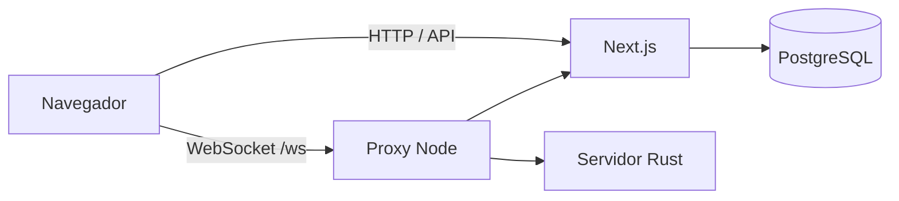

# Play!

Plataforma web de Plays! multiplayer em tempo real. Usuários podem criar,
importar, organizar e publicar Plays!; anfitriões abrem salas com PIN; e
jogadores participam pelo navegador sem precisar de conta.

## Recursos

- cadastro, login e sessão em cookie HTTP-only;
- editor de Plays! com categorias, pastas, CSV e imagens;
- biblioteca pública e catálogo inicial de Plays!;
- partidas ao vivo com PIN, pontuação, ranking e reconexão de jogadores;
- administração de usuários, períodos de acesso e novos cadastros;
- geração opcional de Plays! com a API da OpenAI;
- planos recorrentes de 30, 60 ou 90 dias via Stripe Checkout;
- recuperação de senha por e-mail com SMTP configurável;
- notificações individuais ou gerais administradas pelo superadmin;
- execução em Docker Swarm com PostgreSQL e publicação automática no GHCR.

## Arquitetura



O container da aplicação reúne o servidor Next.js, o proxy Node e o binário
Rust. O proxy publica a porta `3000`, entrega o tráfego HTTP ao Next.js e
encaminha `/ws` ao Rust na porta interna `8000`. O PostgreSQL roda em um serviço
separado e persiste os dados em volume.

## Início rápido para desenvolvimento

Requisitos:

- Node.js 22 ou superior;
- Rust 1.88 ou compatível;
- PostgreSQL 17;
- Google Chrome apenas para os testes E2E.

Instale e valide os módulos isoladamente:

```bash
cd play-frontend
npm ci
npm run typecheck
npm run build

cd ../play-backend
cargo test --locked
```

Para executar o sistema completo localmente, incluindo banco, migrações,
frontend e WebSocket, consulte o
[guia de desenvolvimento](docs/DEVELOPMENT.md).

## Implantação

O arquivo `docker-compose.yml` é uma stack de produção para Docker Swarm,
Traefik e a rede externa `cloudbrnet`. Ele não é um Compose local genérico.

```bash
cp .env.example .env
# edite os segredos antes de continuar
set -a
. ./.env
set +a
docker stack deploy --with-registry-auth -c docker-compose.yml play
```

A imagem padrão é `ghcr.io/josemaeldon/play:latest`. O workflow
`.github/workflows/docker-publish.yml` publica `latest` e
`sha-<commit>` para `linux/amd64` após alterações na branch `main`.

### Assinaturas Stripe

O superadmin configura a chave secreta e o segredo do webhook em
`/admin` → **Configurações** → **Stripe**. No Dashboard da Stripe, aponte o
webhook para `https://seu-dominio/api/stripe/webhook` e assine os eventos
`checkout.session.completed`, `customer.subscription.created`, `updated`,
`deleted`, `paused` e `resumed`. O histórico e o reprocessamento ficam na
mesma seção do painel. As credenciais
também podem ser fornecidas por `STRIPE_SECRET_KEY` e
`STRIPE_WEBHOOK_SECRET`; variáveis de ambiente têm prioridade.

## Documentação

- [Arquitetura e modelo de dados](docs/ARCHITECTURE.md)
- [Configuração e implantação](docs/CONFIGURATION.md)
- [Desenvolvimento e testes](docs/DEVELOPMENT.md)
- [API HTTP e protocolo WebSocket](docs/API.md)

## Estrutura

| Caminho | Responsabilidade |
| --- | --- |
| `play-frontend/` | Interface Next.js, API HTTP e proxy de produção |
| `play-backend/` | servidor de partidas WebSocket em Rust |
| `play-mobile/` | aplicativo Flutter Android/iOS exclusivo para jogadores |
| `db/migrations/` | esquema, índices e dados iniciais do PostgreSQL |
| `.github/workflows/` | build e publicação da imagem Docker |
| `Dockerfile` | build multi-stage e imagem única da aplicação |
| `docker-compose.yml` | stack de produção para Docker Swarm |

## Licença e marca

Este repositório não declara uma licença de código aberto. Use o código e os
ativos respeitando os direitos aplicáveis.
