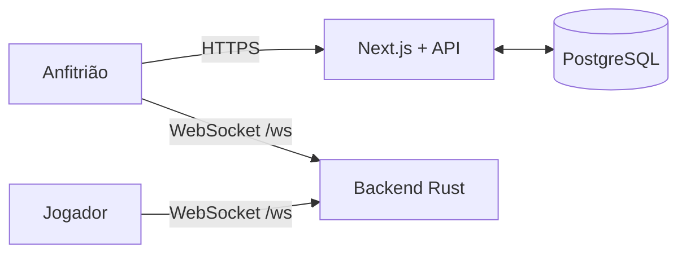

# Kahoot Clone

Jogo multiplayer de perguntas e respostas com criação de quizzes, salas ao
vivo, respostas em tempo real e classificação.

## Arquitetura

O sistema usa:

- **Next.js 16 e React 19** para frontend e API HTTP.
- **PostgreSQL 17** para usuários, quizzes, perguntas e alternativas.
- **Rust, Tokio e Axum** para as partidas via WebSocket.
- **Uma única imagem Docker** para frontend + backend.



A imagem inicia os dois processos e expõe somente a porta `3000`. O servidor
Node encaminha conexões em `/ws` internamente para o backend Rust.

O PostgreSQL é um serviço separado porque seus dados precisam sobreviver à
substituição ou atualização da imagem da aplicação.

## Imagem no GHCR

O pacote está privado no GHCR. Faça login com uma conta que tenha acesso:

```bash
docker login ghcr.io
```

Depois:

```bash
docker pull ghcr.io/josemaeldon/kahoot:latest
```

Tags publicadas:

- `ghcr.io/josemaeldon/kahoot:latest`
- `ghcr.io/josemaeldon/kahoot:1.0.0`

As duas tags usam somente a plataforma `linux/amd64`.

## Executar com Docker Compose

1. Copie o arquivo de exemplo:

```bash
cp .env.example .env
```

2. Troque `POSTGRES_PASSWORD` e `JWT_SECRET` por valores fortes.

3. Inicie o sistema:

```bash
docker compose up -d
```

4. Abra:

```text
http://localhost:3000
```

Para acompanhar o estado:

```bash
docker compose ps
docker compose logs -f app
```

Para encerrar sem apagar o banco:

```bash
docker compose down
```

O volume `postgres_data` mantém os dados. Use `docker compose down -v` somente
quando quiser apagar definitivamente o banco local.

## Variáveis de ambiente

| Variável | Finalidade |
| --- | --- |
| `DATABASE_URL` | URL completa de conexão com o PostgreSQL |
| `DATABASE_POOL_SIZE` | Tamanho do pool usado pela API; padrão `10` |
| `JWT_SECRET` | Segredo de assinatura da sessão, mínimo de 32 caracteres |
| `COOKIE_SECURE` | Use `true` quando a aplicação estiver publicada com HTTPS |
| `APP_PORT` | Porta publicada pelo Compose; padrão `3000` |
| `NEXT_PUBLIC_APP_URL` | URL pública opcional usada no QR Code |
| `NEXT_PUBLIC_WS_URL` | URL WebSocket opcional; por padrão usa `/ws` na mesma origem |
| `KAHOOT_IMAGE` | Imagem usada pelo Compose |

Em produção, mantenha `COOKIE_SECURE=true` e publique a porta da aplicação
atrás de HTTPS.

## Banco de dados

O esquema está em [`db/migrations`](./db/migrations).

Tabelas:

- `users`: contas e hashes de senha.
- `games`: título, autor e datas do quiz.
- `questions`: texto, posição, tempo e índice da resposta correta.
- `choices`: alternativas de cada pergunta.
- `schema_migrations`: histórico das migrações aplicadas.

As relações usam `ON DELETE CASCADE`. Há índices no nome normalizado do
usuário, no autor/data dos quizzes e nas chaves/posições de perguntas e
alternativas.

As migrações são executadas automaticamente antes da aplicação iniciar. Uma
migração já aplicada não pode ser alterada; crie um novo arquivo SQL para cada
mudança futura.

## Autenticação e autorização

- Senhas recebem hash com `bcrypt`, fator 12.
- A sessão é um JWT com duração de sete dias.
- O token fica somente em cookie HTTP-only.
- Consulta, atualização e exclusão de quiz sempre filtram também pelo
  `author_id` da sessão.
- Requisições HTTP e dados enviados ao WebSocket passam por validação.
- As consultas PostgreSQL usam parâmetros, sem interpolação de entrada do
  usuário.

## Fluxo da partida

1. O anfitrião entra na conta, cria um quiz e escolhe **Jogar**.
2. O frontend carrega o quiz e envia `createRoom` pelo WebSocket.
3. O backend valida as perguntas e gera um PIN exclusivo de seis dígitos.
4. Jogadores entram em `/play` com PIN e nome.
5. Nomes duplicados, PIN inexistente e entrada depois do início são recusados.
6. O anfitrião inicia a rodada.
7. Cada jogador envia apenas uma resposta.
8. A rodada termina quando todos respondem, o tempo acaba ou o anfitrião
   avança.
9. O primeiro acerto vale 1.000 pontos; os próximos acertos da rodada recebem
   pontuação progressivamente menor.
10. Depois da última rodada, anfitrião e jogadores recebem `gameEnd`.

As salas são efêmeras e ficam na memória do backend Rust. Reiniciar o container
encerra partidas ativas, mas não apaga usuários nem quizzes do PostgreSQL.

## Desenvolvimento

### Frontend

Requer Node.js 22 ou superior:

```bash
cd kahoot-clone-frontend
npm ci
npm run dev
```

Para o frontend local acessar os demais serviços, configure `DATABASE_URL`,
`JWT_SECRET`, `COOKIE_SECURE=false` e, se o Rust estiver separado,
`NEXT_PUBLIC_WS_URL=ws://localhost:8000/ws`.

### Backend Rust

```bash
cd kahoot-clone-backend
cargo run
```

O backend escuta na porta `8000` por padrão:

- `GET /health`
- `GET /ws` com upgrade para WebSocket

## Testes

### Frontend e TypeScript

```bash
cd kahoot-clone-frontend
npm run typecheck
npm run build
```

### Teste de ponta a ponta

Com o Compose em execução e Google Chrome instalado:

```bash
cd kahoot-clone-frontend
npm run test:e2e
```

O teste automatizado cobre:

- cadastro e sessão;
- criação e persistência de quiz no PostgreSQL;
- criação de sala e PIN;
- entrada de jogador em viewport móvel;
- rodada, resposta, pontuação e resultado final;
- console do navegador e overflow horizontal.

### Backend

```bash
cd kahoot-clone-backend
cargo test --locked
```

Os testes do Rust cobrem criação e entrada em sala, sala inexistente, nome
duplicado e entrada/saída.

### Auditoria

```bash
cd kahoot-clone-frontend
npm audit
```

## Estrutura principal

| Caminho | Conteúdo |
| --- | --- |
| `db/migrations` | Esquema PostgreSQL versionado |
| `kahoot-clone-frontend/pages` | Telas e API HTTP |
| `kahoot-clone-frontend/lib` | Banco, sessão, validação e repositórios |
| `kahoot-clone-frontend/e2e` | Teste Playwright do sistema completo |
| `kahoot-clone-backend/src/ws` | Salas, protocolo e pontuação |
| `Dockerfile` | Build multi-stage de frontend + backend |
| `docker-compose.yml` | Aplicação e PostgreSQL |
